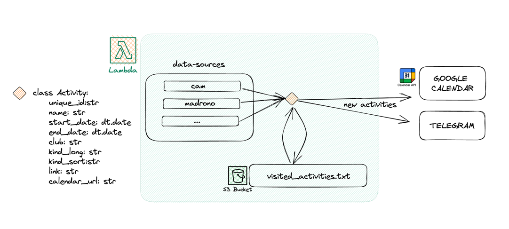

# activity-events-calendar
Small application to aggregate activities from different websites into google calendar, and sends Telegram notifications
everytime there is a new activity. 

The application is written in Python, and uses AWS Lambda as the orchestrator. Everytime it is executed, the application 
web-scrapes the websites (data-sources) to extract the activities which are loaded in an array of type Activity.

This way, all the data-sources are parsed to the same schema. The application then checks if the activities are new, 
and if they are, it adds them to the calendar, and sends a Telegram notification.

State of activities is stored in a .txt file in s3. The state is used to avoid adding the same activity twice to the calendar.

In order to run the application, you need to provide the following:
- Telegram bot & token
- Google calendar id & google service account credentials (with permissions to write in te calendar)

### Pending work:
- provide is_test as an argument
- create CICD in github actions to create the zip file used by the lambda, and upload to s3
- Other data sources (madrono, pegaso, conbici, etc)
- Create a dry_run option
- Add tests
- Add subscription date to CAM